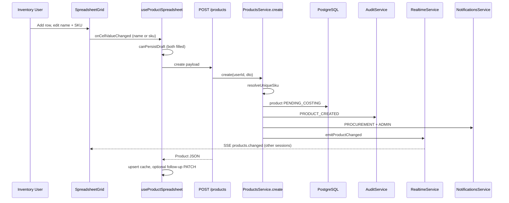
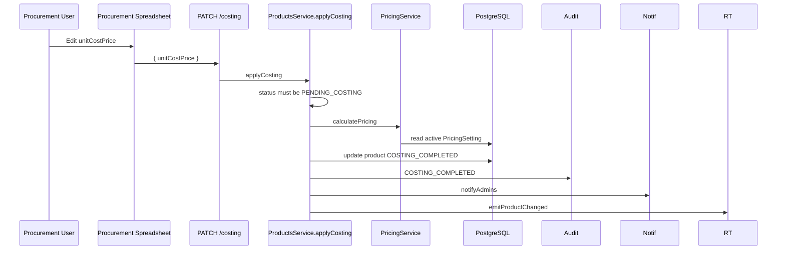
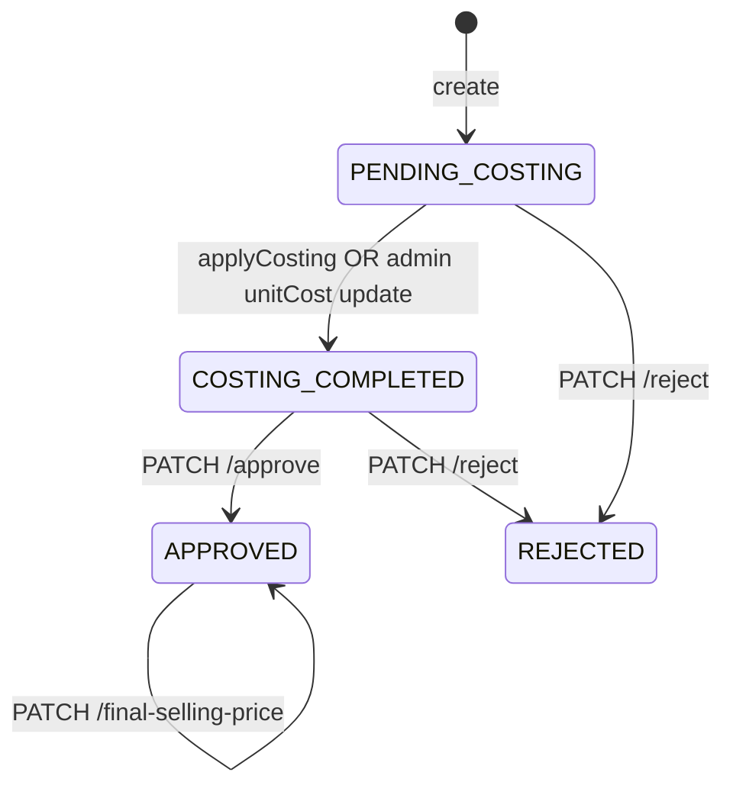
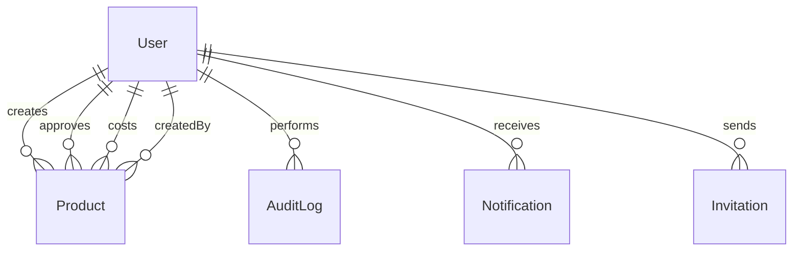

# IPMP — Technical Documentation

**Inventory & Pricing Management Platform**

This document describes the **implemented** behavior of the IPMP codebase (NestJS API + Next.js frontend). It is derived from source inspection, not assumptions. Where functionality is absent, it is marked **Not Implemented**.

---

## Table of Contents

1. [Project Purpose](#1-project-purpose)
2. [Architecture Overview](#2-architecture-overview)
3. [Data Flow](#3-data-flow)
4. [Request Flow](#4-request-flow)
5. [Business Rules](#5-business-rules)
6. [Key Feature Deep Dives](#6-key-feature-deep-dives)
7. [Database Documentation](#7-database-documentation)
8. [Environment Configuration](#8-environment-configuration)
9. [Error Handling Strategy](#9-error-handling-strategy)
10. [Major Technical Decisions](#10-major-technical-decisions)
11. [Examples](#11-examples)
12. [Known Limitations](#12-known-limitations)

---

## 1. Project Purpose

### Business objective

IPMP replaces spreadsheet-centric inventory, costing, and pricing approval workflows with a **role-based web application**. Operations teams create products in a worksheet-style UI, procurement applies unit costs and triggers formula-driven pricing, and administrators approve final selling prices—with **audit trails**, **in-app notifications**, and **live grid updates** across roles.

The login experience brands the platform as **CETECH**; the application title in navigation and copy refers to **IPMP** (Inventory & Pricing Management).

### Operational problem solved

| Pain (spreadsheet era) | IPMP response (implemented) |
|------------------------|----------------------------|
| Disconnected inventory / procurement / admin steps | Shared product record with `ProductStatus` workflow |
| Manual price calculations | Server-side `PricingService.calculatePricing()` from active `PricingSetting` |
| No authoritative audit trail | `AuditLog` rows with `actorEmail` snapshot at write time |
| Delayed awareness of new work | Notifications + SSE `products.changed` / `notifications.changed` |
| Weak role separation | Nest `@Roles()` + frontend `AppShell` / sidebar filtering |

### Intended users and roles

| Role | Enum | Primary UI routes | Responsibility |
|------|------|-------------------|----------------|
| **Inventory** | `INVENTORY` | `/inventory` | Create/edit products before costing; SKU, name, quantity, unit, old selling price |
| **Procurement** | `PROCUREMENT` | `/procurement` | Enter **unit cost price** for `PENDING_COSTING` products; triggers costing |
| **Admin** | `ADMIN` | `/dashboard`, `/workspace`, `/pricing`, `/users`, `/audit` | Full lifecycle, approvals, pricing config, user admin, audit review |

Role home redirects (`ROLE_HOME` in `frontend/src/lib/api/types.ts`):

- `ADMIN` → `/dashboard`
- `INVENTORY` → `/inventory`
- `PROCUREMENT` → `/procurement`

### Core capabilities (implemented)

- **Inventory worksheets** — AG Grid + draft rows (`use-product-spreadsheet.ts`)
- **Procurement costing** — `PATCH /products/:id/costing`
- **Admin workspace** — unified spreadsheet, approval sidebar, reject/approve
- **Pricing formula** — configurable rates; min @ 20% and min @ 4% tax-inclusive floors
- **Approvals** — `COSTING_COMPLETED` → `APPROVED` with `finalSellingPrice`
- **Notifications** — per-user inbox; role-targeted creates
- **Auditability** — immutable-style log with actor email, SKU, JSON snapshots
- **Realtime** — SSE fan-out for product and notification cache updates

---

## 2. Architecture Overview

### Repository layout

```
IPMP/
├── backend/                 # NestJS 11 API (port 3000 default)
│   ├── prisma/              # schema, migrations, seed
│   └── src/
│       ├── main.ts          # bootstrap, ValidationPipe, CORS
│       ├── app.module.ts
│       ├── common/          # guards, decorators, utils
│       ├── prisma/          # PrismaService
│       └── modules/         # feature modules
├── frontend/                # Next.js 15 App Router (port 3001 dev)
│   └── src/
│       ├── app/             # routes: (auth), (app)
│       ├── components/      # UI, grid, layout
│       ├── hooks/           # spreadsheet + TanStack Query
│       ├── lib/             # api, auth, audit, products, realtime
│       └── providers/       # Auth, Query, Realtime
```

### Backend architecture

- **Framework:** NestJS with modular boundaries (`AuthModule`, `ProductsModule`, `PricingModule`, `AuditModule`, `NotificationsModule`, `InvitationsModule`, `RealtimeModule`, `UsersModule`).
- **Persistence:** PostgreSQL via Prisma 7 (`PrismaPg` adapter in `PrismaService`).
- **Auth:** Passport JWT (`JwtStrategy`) + refresh token strategy; `JwtAuthGuard` + `RolesGuard` on controllers.
- **Validation:** Global `ValidationPipe` — `whitelist`, `transform`, `forbidNonWhitelisted` (`backend/src/main.ts`).
- **Cross-cutting:** `AuditService.logAction()` called explicitly from domain services (no audit middleware).

`RealtimeModule` is `@Global()` and exports `RealtimeService` for product/notification broadcasts.

### Frontend architecture

- **Framework:** Next.js 15 App Router, React 19, client components on interactive pages.
- **Styling:** Tailwind CSS v4, shadcn/ui primitives.
- **Data fetching:** TanStack Query v5 (`QueryProvider`: `staleTime` 30s, `retry` 1).
- **Grids:** AG Grid Community 33 (`SpreadsheetGrid`, `AuditLogGrid`).
- **HTTP:** Axios `apiClient` with Bearer injection and 401 refresh queue (`frontend/src/lib/api/client.ts`).
- **Auth state:** React context (`AuthProvider`) + `localStorage` / `sessionStorage` tokens.
- **Realtime:** `RealtimeProvider` subscribes to SSE when `user` is set.

**Not Implemented:** Next.js `middleware.ts` for server-side route protection. All authorization is **client-side** via `useRequireAuth` in `AppShell`.

### API organization

REST JSON under backend root (no `/api` prefix). Grouped by controller:

| Prefix | Module |
|--------|--------|
| `/auth` | register, login, refresh, logout |
| `/users` | profile + admin CRUD |
| `/products` | CRUD, costing, approve, reject, printed, final price |
| `/pricing/settings` | active, list, create, activate |
| `/audit` | list (ADMIN) |
| `/notifications` | list, mark read |
| `/invitations` | admin CRUD, public accept |
| `/realtime/stream` | SSE |

### Shared utilities

| Location | Purpose |
|----------|---------|
| `backend/src/common/utils/decimal.util.ts` | `toDecimal`, `roundMoney` (2dp half-up), `decimalToString` |
| `backend/src/common/utils/currency.util.ts` | `formatGhsDisplay` — ₵ for notification strings |
| `backend/src/common/utils/sku.util.ts` | `generateSkuCandidate()` → `PRD-XXXXXXXX` |
| `frontend/src/lib/utils.ts` | `formatCurrency` (₵ display), `formatDate` |
| `frontend/src/lib/products/product-cache.ts` | TanStack cache upsert for product lists |
| `frontend/src/lib/audit/display.ts` | Actor email, SKU extraction, action formatting |

### Configuration strategy

- Backend: `@nestjs/config` global `.env` (`ConfigModule.forRoot` in `app.module.ts`).
- Frontend: `NEXT_PUBLIC_*` only (`NEXT_PUBLIC_API_URL`).
- No committed `.env.example` in repository (documented in `frontend/README.md` only).

---

## 3. Data Flow

### Product creation flow (Inventory / Admin)



**Implementation notes:**

1. Draft row gets client SKU via `generateSkuCandidate()` (`frontend/src/lib/products/sku.ts`) — mirrors backend alphabet.
2. Persist triggers when **both** `name` and `sku` are non-empty (`shouldPersistDraft`).
3. On `409` SKU conflict, frontend regenerates SKU and retries once.
4. Backend may auto-generate SKU if omitted (`resolveUniqueSku`).

### Costing flow (Procurement)



Procurement grid shows `PENDING_COSTING` plus recent `COSTING_COMPLETED` (`procurement/page.tsx`).

### Approval flow (Admin)



Admin opens `ApprovalPanel` from workspace grid, sets final price (defaults to `minimum20Percent`), clicks **Approve Product** → `PATCH /products/:id/approve`.

---

## 4. Request Flow

### Standard HTTP path

```
Browser (React)
  → TanStack Query mutation / query OR Axios direct
  → apiClient (Authorization: Bearer accessToken)
  → NestJS Controller (@UseGuards JwtAuthGuard, RolesGuard)
  → ValidationPipe (DTO class-validator)
  → Service (business logic, Prisma)
  → Prisma Client → PostgreSQL
  → Service side effects (audit, notifications, realtime)
  → JSON response (decimals as strings via decimalToString)
  → React Query cache update / toast
```

### Guards and user injection

- `JwtAuthGuard` validates access JWT; `JwtStrategy.validate` loads user, rejects inactive.
- `@GetUser('id')` / `@GetUser('role')` from `request.user` (`get-user.decorator.ts`).
- `RolesGuard` reads `@Roles(...)` metadata; throws if role mismatch.

### DTO example: product create

**Request:** `POST /products`

```json
{
  "name": "Widget A",
  "quantity": 10,
  "unit": "pcs",
  "sku": "PRD-AB12CD34",
  "oldSellingPrice": 25.5
}
```

**Validation** (`CreateProductDto`): `name`, `quantity` ≥ 1, `unit` required; optional `sku`, `oldSellingPrice` ≥ 0.

**Service:** `ProductsService.create(userId, dto)` → status `PENDING_COSTING`, `createdById = userId`.

**Response:** Product object with money fields as `"123.45"` strings.

### DTO rejection example

`PATCH /products/:id` with `{ "finalSellingPrice": 100 }` on non-approved product paths through `UpdateProductDto`, which **does not** include `finalSellingPrice`. With `forbidNonWhitelisted: true`, Nest returns:

```json
{
  "statusCode": 400,
  "message": ["property finalSellingPrice should not exist"],
  "error": "Bad Request"
}
```

**Correct paths for final price:**

- Pre-approval: `PATCH /products/:id/approve` (`ApproveProductDto`)
- Post-approval: `PATCH /products/:id/final-selling-price` (`UpdateFinalSellingPriceDto`)

---

## 5. Business Rules

### Product creation

| Rule | Implementation |
|------|----------------|
| Creators | `ADMIN`, `INVENTORY` only (`products.controller.ts`) |
| Initial status | `PENDING_COSTING` |
| SKU uniqueness | DB `@unique` on `sku`; service checks before create |
| Auto SKU | `PRD-{8}` from `ABCDEFGHJKLMNPQRSTUVWXYZ23456789` |
| `createdById` | JWT `userId` at create time |

### Inventory update rules

| Rule | Implementation |
|------|----------------|
| Editable statuses | `PENDING_COSTING`, `REJECTED` only |
| Cannot set `unitCostPrice` | `ForbiddenException` for INVENTORY |
| Fields | `sku`, `name`, `quantity`, `unit`, `oldSellingPrice` via `UpdateProductDto` |

### Procurement costing

| Rule | Implementation |
|------|----------------|
| Endpoint | `PATCH /products/:id/costing` |
| Roles | `PROCUREMENT`, `ADMIN` |
| Precondition | `status === PENDING_COSTING` |
| Effect | All pricing columns populated; `costingCompletedById`; status → `COSTING_COMPLETED` |

### Admin product update

| Rule | Implementation |
|------|----------------|
| `unitCostPrice` on `PENDING_COSTING` | Recalculates pricing; may auto-complete costing (`COSTING_COMPLETED`) |
| `finalSellingPrice` via generic PATCH | **Rejected** (not in DTO) |

### Approval

| Rule | Implementation |
|------|----------------|
| Role | `ADMIN` only |
| Precondition | `COSTING_COMPLETED` |
| Sets | `finalSellingPrice`, `printed`, `approvedById`, `APPROVED` |
| Min price validation | **Not Implemented** — no check against `minimum20Percent` / `minimum4Percent` |

### Rejection

| Rule | Implementation |
|------|----------------|
| Allowed from | `COSTING_COMPLETED` or `PENDING_COSTING` |
| Result | `REJECTED`; optional `reason` in audit `newValue` |

### Final selling price after approval

| Rule | Implementation |
|------|----------------|
| Only on `APPROVED` products | `updateFinalSellingPrice` |
| No-op | If price unchanged (returns current without audit) |
| Audit | `SELLING_PRICE_CHANGED` |
| Notify | Creator + costing completer |

### Visibility / list access

| Rule | Implementation |
|------|----------------|
| `GET /products` | Any authenticated user (no role filter on list) |
| Frontend scopes | Each role page loads relevant subsets client-side |
| `GET /audit` | `ADMIN` only |

### Authentication persistence

| Rule | Implementation |
|------|----------------|
| Access token expiry | `JWT_ACCESS_EXPIRES_IN` (default `1h`) |
| Refresh token expiry | `JWT_REFRESH_EXPIRES_IN` (default `24h`) |
| Remember me | Tokens in `localStorage` vs `sessionStorage` (`session.ts`) |
| Refresh storage | Bcrypt-hashed refresh token on `User.refreshToken` |
| Logout | Clears DB refresh token + client session |

### Audit behavior

| Rule | Implementation |
|------|----------------|
| Actor | `userId` + denormalized `actorEmail` at write time |
| SKU column | `entitySku` from param or JSON `sku` on Product entities |
| IP / User-Agent | Schema fields exist; **never populated** in `logAction` |

### Notification triggers

| Event | Recipients | Type |
|-------|------------|------|
| Product created | PROCUREMENT, ADMIN | `PRODUCT_CREATED` |
| Costing completed | All ADMIN | `COSTING_COMPLETED` |
| Approved | Product creator | `PRODUCT_APPROVED` |
| Price changed | Creator + costing user | `SELLING_PRICE_CHANGED` |
| Rejected | Creator | `SYSTEM` |
| Invitation created | Inviter | `USER_INVITATION_SENT` |

### SKU uniqueness

- Max **8** generation attempts server-side before `ConflictException`.
- Frontend retries once with new candidate on 409 SKU conflict.

### Invitations

| Rule | Implementation |
|------|----------------|
| Expiry | 7 days |
| Token | 32-byte hex |
| Email delivery | **Not Implemented** — token returned in API only |
| Frontend accept UI | **Not Implemented** — API exists, no page |

### Pricing settings

| Rule | Implementation |
|------|----------------|
| Active config | Single `isActive: true` (latest wins on create) |
| Rate bounds | DTO: each rate 0–1 |
| Audit | `PRICING_SETTINGS_UPDATED` on create/activate |

### Currency display

| Rule | Implementation |
|------|----------------|
| UI | `formatCurrency` → `₵` + `en-GH` grouping (`frontend/src/lib/utils.ts`) |
| API storage | `Decimal(10,2)` — no currency code in DB |
| Notifications | `formatGhsDisplay` on price strings |

---

## 6. Key Feature Deep Dives

### 6.1 SKU auto generation

**Purpose:** Assign human-readable unique identifiers without manual entry.

**Where generation occurs:**

| Layer | File | Function |
|-------|------|----------|
| Frontend (draft row) | `frontend/src/lib/products/sku.ts` | `generateSkuCandidate()` |
| Backend (persist) | `backend/src/common/utils/sku.util.ts` | `generateSkuCandidate()` |
| Backend (preview API) | `ProductsService.suggestSku()` | `GET /products/sku-preview` |

**Algorithm:** Prefix `PRD-` + 8 characters from `SKU_ALPHABET` (excludes ambiguous `I`, `O`, `0`, `1`) using `crypto.randomBytes`.

**Uniqueness:**

1. Client proposes SKU on draft row creation.
2. On create, `resolveUniqueSku(trimmedProvided)` checks DB; if taken → `ConflictException`.
3. If no SKU provided, server loops up to 8 random candidates.

**Lifecycle timing:**

```
Add Row → draft sku assigned client-side
  → user fills name + sku
  → POST /products
  → (optional) follow-up PATCH for unit/qty/old price deltas
```

**Edge cases:** Empty SKU on create → server generates. Duplicate on create → frontend retry with new SKU once.

---

### 6.2 Server-Sent Events (SSE)

**Purpose:** Push product and notification changes to connected clients without polling.

**Publisher:** `RealtimeService` (`backend/src/modules/realtime/realtime.service.ts`)

- In-memory RxJS `Subject<BusMessage>`.
- `emitProductChanged(product)` → all active users in `ADMIN`, `PROCUREMENT`, `INVENTORY`.
- `emitNotificationsChanged(userIds)` → targeted users.

**Subscriber:** `GET /realtime/stream` (`RealtimeController`, `@Sse`, `JwtAuthGuard`)

- Per-user filtered observable: `subscribe(userId)` filters bus by `userId`.

**Frontend:** `connectRealtimeStream` (`fetch-event-source`) in `RealtimeProvider`

- Headers: `Authorization: Bearer`, `Accept: text/event-stream`
- `openWhenHidden: true`
- On error: reconnect after **3 seconds**
- On `products.changed` with `product`: `upsertProductInAllListCaches`
- On `notifications.changed`: invalidate notification queries

**Payload structure:**

```json
{
  "type": "products.changed",
  "product": { "id": "...", "name": "...", "status": "...", "...": "..." }
}
```

```json
{
  "type": "notifications.changed"
}
```

SSE wire format: Nest `MessageEvent` with `data: JSON.stringify(event)`.

**Limitations (codebase-verified):**

- Single-process memory bus — **no Redis / multi-instance fan-out**
- **No event replay** on reconnect — client refetches via cache invalidation only
- Connection requires valid access token; no SSE if token missing

---

### 6.3 Authentication

**Login flow:**

1. `POST /auth/login` → `AuthService.login`
2. Validate password (bcrypt), `isActive`
3. `generateTokens` → access + refresh JWTs
4. Hash refresh token → store on user
5. Frontend `setTokens`, `setUserInStorage`, `router.replace(ROLE_HOME[role])`

**Token handling:**

| Token | Secret | Default expiry | Storage (client) |
|-------|--------|----------------|------------------|
| Access | `JWT_SECRET` | `1h` | `ipmp_access_token` |
| Refresh | `JWT_REFRESH_SECRET` | `24h` | `ipmp_refresh_token` |

**Refresh:** `POST /auth/refresh` with `RefreshTokenGuard`; rotates both tokens.

**401 handling:** Axios interceptor single-flights refresh; failure → `clearSession()` + `window.location.href = '/login'`.

**Session validation on load:** `AuthProvider` calls `usersApi.me()`; on failure attempts refresh once.

**Public routes:** `/login`, `POST /auth/register`, `POST /invitations/accept`.

**Register:** Default role `PROCUREMENT`; password complexity regex on `RegisterDto`.

---

### 6.4 Pricing formula system

**Configuration:** `PricingSetting` rows; exactly one active (`isActive: true`) used by `getActiveSettings()`.

**Equations** (`PricingService.calculatePricing`):

Let `CP = round(unitCost × quantity)`.

| Output field | Formula |
|--------------|---------|
| `investmentFund` | `CP × investmentFundRate` |
| `operationProfit` | `CP × operationProfitRate` |
| `netProfit` | `operationProfit × netProfitRateOfOP` |
| `payrollFund` | `(operationProfit − netProfit) × payrollRateOfOPMinusNP` |
| `otherCosts` | `(operationProfit − netProfit) × otherCostsRateOfOPMinusNP` |
| `grossProfit` | `investmentFund + operationProfit` |
| `priceBeforeTax` | `CP + grossProfit` |
| `minimum20Percent` | `priceBeforeTax + priceBeforeTax × salesTaxRate20` |
| `minimum4Percent` | `priceBeforeTax + priceBeforeTax × salesTaxRate4` |

All intermediate values use `roundMoney` (2 decimal places, half-up).

**Triggers:**

- `applyCosting` (procurement)
- Admin `update` with `unitCostPrice` on pending product

**Final selling price:** Set only at approval or post-approval update — **not** computed by formula automatically.

**Admin UI preview:** `frontend/src/app/(app)/pricing/page.tsx` mirrors formula client-side for sliders; server remains source of truth on persist.

**Seed defaults** (`prisma/seed.ts`): IF 6%, OP 35%, NP 15% of OP, payroll 81%, other 19%, tax 20% / 4%.

---

### 6.5 Audit logs

**Creation:** Explicit `auditService.logAction()` from `ProductsService`, `PricingService` — not middleware.

**Actor attribution:**

- `userId` from JWT at mutation time
- `actorEmail` resolved at write (DB lookup if not passed)
- UI displays `actorEmail ?? user.email ?? userId` (`lib/audit/display.ts`)

**Timeline:** `audit/page.tsx` — right column, first 15 filtered logs, expandable JSON.

**AG Grid:** `AuditLogGrid` — User, Action, Entity, SKU, Timestamp; pagination 25/50/100.

**Search:**

- Server: `GET /audit?search=` — `actorEmail`, `action`, `entityType`, `entitySku` (case-insensitive contains)
- Client: AG Grid `quickFilterText` on loaded rows

**Actions logged:** See `audit-actions.ts` constants table in section 5.

---

### 6.6 Notifications

**Storage:** `Notification` model per `userId`.

**Delivery:**

1. Insert row(s) in PostgreSQL
2. `RealtimeService.emitNotificationsChanged(userIds)`
3. Client invalidates TanStack `notificationKeys`

**UI:** `NotificationCenter` in topbar; poll interval 120s on unread query plus SSE invalidation.

**Email/push:** **Not Implemented**

---

### 6.7 Approval workflow

**States:** See state diagram in section 3.

**Sidebar (`ApprovalPanel`):**

- Pricing breakdown (read-only calculated fields)
- Final price input when `COSTING_COMPLETED`
- Sticky footer **Approve Product** with loading state
- `onApprove(product, finalSellingPrice)` → `productsApi.approve`

**Grid actions:** Inline Approve opens panel; Reject calls `reject.mutate` directly.

**Permissions:** Page `allowedRoles={['ADMIN']}`; API `@Roles(Role.ADMIN)` on approve/reject.

---

## 7. Database Documentation

### Entity relationship (conceptual)



### `User`

**Why:** Authentication, role authorization, audit actor FK, notification recipient.

| Field | Notes |
|-------|-------|
| `email` | Unique login |
| `password` | Bcrypt hash |
| `role` | `ADMIN` \| `INVENTORY` \| `PROCUREMENT` |
| `refreshToken` | Bcrypt hash of current refresh JWT |
| `isActive` | Deactivated users cannot login |
| `lastLoginAt` | Updated on login |

Indexes: `email`, `role`.

### `Product`

**Why:** Central operational record for inventory → costing → approval.

Key fields: pricing decimals, `status`, `sku` (unique), workflow FKs (`createdById`, `approvedById`, `costingCompletedById`).

Indexes: `name`, `status`, `sku`, `createdAt`.

### `PricingSetting`

**Why:** Versioned formula rate configuration; supports activate/create without mutating history.

Rates stored as `Decimal(6,4)` fractions (e.g. `0.2` = 20%).

### `AuditLog`

**Why:** Compliance and operational forensics.

| Field | Why |
|-------|-----|
| `actorEmail` | Immutable display of who acted (even if user email changes later) |
| `entitySku` | Fast search/display without parsing JSON |
| `oldValue` / `newValue` | Field-level snapshots |

`ipAddress`, `userAgent`: reserved — **unused in writes**.

### `Notification`

**Why:** In-app actionable awareness per user.

### `Invitation`

**Why:** Admin-provisioned onboarding with role pre-assignment.

Unique `token`; status `PENDING` \| `ACCEPTED` \| `EXPIRED`.

---

## 8. Environment Configuration

### Backend (`backend/.env` — gitignored)

| Variable | Required | Purpose | Default in code |
|----------|----------|---------|-----------------|
| `DATABASE_URL` | Yes | PostgreSQL connection | — |
| `JWT_SECRET` | Yes | Access JWT signing | — |
| `JWT_REFRESH_SECRET` | Yes | Refresh JWT signing | — |
| `JWT_ACCESS_EXPIRES_IN` | No | Access TTL | `1h` |
| `JWT_REFRESH_EXPIRES_IN` | No | Refresh TTL | `24h` |
| `PORT` | No | HTTP port | `3000` |
| `JWT_EXPIRES_IN` | No | Registered in `JwtModule` only | `900` (largely unused by `AuthService`) |
| `CORS_ORIGIN` | Documented in README | **Not read** — `main.ts` uses `origin: true` |

### Frontend (`frontend/.env.local` — gitignored)

| Variable | Required | Purpose | Default |
|----------|----------|---------|---------|
| `NEXT_PUBLIC_API_URL` | No | API + SSE base URL | `http://localhost:3000` |

---

## 9. Error Handling Strategy

### Validation errors

- `class-validator` on DTOs → 400 with message array
- `forbidNonWhitelisted` strips unknown fields and errors on extras

### Auth errors

- `UnauthorizedException` — bad credentials, inactive user, invalid refresh
- Frontend: toast on login failure; redirect on refresh failure

### Business rule errors

- `BadRequestException` — wrong product status for operation
- `ForbiddenException` — role cannot perform action (e.g. inventory + unit cost)
- `ConflictException` — duplicate SKU, email, invitation
- `NotFoundException` — missing product, notification, settings

### UI handling

- Mutations: `toast.error(getErrorMessage(err))` via Sonner
- Product load failures: `ProductsLoadError` component
- Spreadsheet update failure: invalidates product queries on update error

### Realtime failure

- SSE error → 3s reconnect loop in `RealtimeProvider`
- Malformed SSE messages silently ignored

---

## 10. Major Technical Decisions

| Decision | Reason | Benefit | Tradeoff |
|----------|--------|---------|----------|
| **AG Grid** | Spreadsheet UX expectation | Inline edit, filter, sort, pagination | Bundle size; Community edition limits |
| **SSE vs WebSockets** | One-way server push sufficient | Simple HTTP auth reuse | No bidirectional; single-server bus |
| **TanStack Query** | Server state caching | Deduped fetches, cache invalidation on SSE | Client-side staleness up to `staleTime` |
| **JWT + refresh** | Stateless API scaling | Standard Nest/passport pattern | Refresh rotation complexity |
| **Generated SKUs** | Reduce manual errors | Fast draft row creation | Collision retry needed |
| **Audit `actorEmail` snapshot** | Correct historical attribution | Admin viewer sees true actor | Extra column + lookup on write |
| **Role-separated routes** | Least privilege UX | Clear operational boundaries | No server-side list filtering by role |
| **Prisma Decimal** | Money precision | Consistent 2dp rounding | String serialization at API boundary |
| **Explicit audit calls** | Clear audit points | Predictable log coverage | Easy to miss new mutations |

---

## 11. Examples

### Sample: create product

**Request**

```http
POST /products
Authorization: Bearer <access>
Content-Type: application/json

{
  "name": "Industrial Valve",
  "quantity": 5,
  "unit": "pcs",
  "sku": "PRD-K7M2NP4X"
}
```

**Response (excerpt)**

```json
{
  "id": "550e8400-e29b-41d4-a716-446655440000",
  "name": "Industrial Valve",
  "sku": "PRD-K7M2NP4X",
  "status": "PENDING_COSTING",
  "unitCostPrice": null,
  "minimum20Percent": null,
  "createdById": "<inventory-user-id>",
  "createdAt": "2026-06-01T12:00:00.000Z"
}
```

### Sample: approve product

**Request**

```http
PATCH /products/{id}/approve
Authorization: Bearer <admin-access>

{
  "finalSellingPrice": 1250.00,
  "printed": false
}
```

### Sample: audit log row (shape)

```json
{
  "id": "...",
  "userId": "...",
  "actorEmail": "inventory@company.com",
  "action": "PRODUCT_CREATED",
  "entityType": "Product",
  "entityId": "...",
  "entitySku": "PRD-K7M2NP4X",
  "newValue": { "name": "Industrial Valve", "sku": "PRD-K7M2NP4X", "status": "PENDING_COSTING" },
  "createdAt": "2026-06-01T12:00:01.000Z"
}
```

### Sample: notification

```json
{
  "title": "Costing completed",
  "message": "Costing for Industrial Valve has been completed and is ready for approval.",
  "type": "COSTING_COMPLETED",
  "isRead": false
}
```

### Sample: SSE payload

```json
{
  "type": "products.changed",
  "product": {
    "id": "...",
    "status": "COSTING_COMPLETED",
    "unitCostPrice": "100.00",
    "minimum20Percent": "245.60"
  }
}
```

### Sample SKU

`PRD-AB12CD34` (prefix + 8 chars from safe alphabet)

---

## 12. Known Limitations

Verified from code — not speculative:

| Limitation | Detail |
|------------|--------|
| No server-side route guard (Next.js) | Wrong-role URLs redirect client-side only |
| SSE single-instance | In-memory bus; horizontal scaling requires external pub/sub (**Not Implemented**) |
| No SSE replay | Reconnect relies on query invalidation / refetch |
| `finalSellingPrice` vs minimums | No validation on approve |
| Audit IP/User-Agent | Schema only; never written |
| Invitation email | Token in API response; no mailer |
| Invitation accept UI | Backend only; **Not Implemented** on frontend |
| Rate limiting | Throttle decorators exist; `ThrottlerModule` **Not Implemented** |
| `CORS_ORIGIN` env | Documented but unused (`origin: true`) |
| `GET /products` | All roles see all products in API; scoping is UI-only |
| Dashboard stats | No `COSTING_COMPLETED` count in `getStats` |
| `GET /audit/:id` | Mentioned in some docs; endpoint **Not Implemented** |
| Helmet / security headers | **Not Implemented** in `main.ts` |
| E2E tests | `test/app.e2e-spec.ts` exists; not part of production feature set |

---

## Appendix: File reference index

| Concern | Primary files |
|---------|----------------|
| Bootstrap | `backend/src/main.ts`, `backend/src/app.module.ts` |
| Products | `backend/src/modules/products/products.service.ts`, `products.controller.ts` |
| Pricing | `backend/src/modules/pricing/pricing.service.ts` |
| Auth | `backend/src/modules/auth/auth.service.ts`, `frontend/src/providers/auth-provider.tsx` |
| SSE | `backend/src/modules/realtime/*`, `frontend/src/providers/realtime-provider.tsx` |
| Spreadsheet | `frontend/src/hooks/use-product-spreadsheet.ts`, `components/grid/spreadsheet-grid.tsx` |
| Approval | `frontend/src/components/grid/approval-panel.tsx`, `app/(app)/workspace/page.tsx` |
| Audit | `backend/src/modules/audit/audit.service.ts`, `frontend/src/app/(app)/audit/page.tsx` |

---

*Document generated from codebase inspection. Last aligned with repository structure including `actorEmail`, `entitySku`, Ghana Cedis (₵) display, and AG Grid audit table.*
